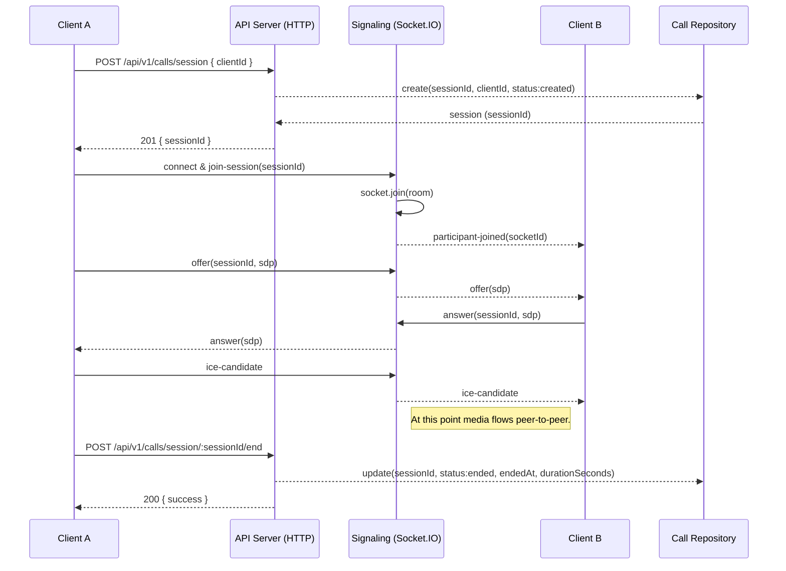

# Call Flow — Call Module

## Overview
- Base route: `/api/v1/calls` (mounted in `src/app.js`).
- Primary responsibilities: create call sessions, retrieve session info, end sessions, and handle real-time signaling via sockets.

## HTTP Endpoints
- POST `/api/v1/calls/session` — `createSession` (`src/modules/calls/call.controller.js`) : Create a new call session. Returns a `sessionId`.
- GET `/api/v1/calls/session/:sessionId` — `getSession` : Retrieve session details.
- POST `/api/v1/calls/session/:sessionId/end` — `endSession` : End an existing session and compute duration.
- PATCH `/api/v1/calls/session/:sessionId/accept` — `acceptSession` : Accept the incoming call and activate the session.
- PATCH `/api/v1/calls/session/:sessionId/reject` — `rejectSession` : Reject the incoming call and end the session immediately.

> Implementation notes: routes are defined in `src/modules/calls/call.routes.js` and mounted under `/calls` by `src/routes/index.js` then prefixed with `/api/v1/` in `src/app.js`.
> Socket.IO signaling is initialized in `server.js` and handled by `src/modules/calls/signaling.socket.js`.

## Real-time Signaling (WebSocket events)
The signaling implementation is now in `src/modules/calls/signaling.socket.js` and is wired into the app from `server.js` using Socket.IO. It supports the following socket events:

- Client -> Server:
  - `join-session` { sessionId } — client joins the session room.
  - `offer` { sessionId, ... } — send SDP offer to other participants.
  - `answer` { sessionId, ... } — send SDP answer back.
  - `ice-candidate` { sessionId, ... } — forward ICE candidates.
  - `leave-session` { sessionId } — leave the session room.

- Server -> Room:
  - `participant-joined` { socketId, participants } — broadcast when a participant joins.
  - `participant-left` { socketId, participants } — broadcast when a participant leaves.
  - `call-started` — emitted when two participants are connected and the session becomes active.
  - `offer` / `answer` / `ice-candidate` — forwarded to the other participants.

## Sequence Diagram

## Step-by-step Call Flow
1. Initiate call (Create session)
  - Client -> HTTP: POST `/api/v1/calls/session` with body `{ clientId }`.
  - Server: `createSession` creates a record with `sessionId` and `status: "created"`.
  - Response: `201 { success: true, data: { sessionId, ... } }`.

2. Notify / Ring callee (optional)
  - Bruno collection includes a `Ring` request (`bruno/Calls/Ring.bru`) that PATCHes `/api/v1/calls/{{callId}}/ring` in some examples.
  - Accept and reject are now implemented via:
    - `PATCH /api/v1/calls/session/:sessionId/accept`
    - `PATCH /api/v1/calls/session/:sessionId/reject`
  - The `Ring` endpoint is still only present in Bruno examples and not implemented in the current backend code.

3. Participants connect to signaling (Socket.IO)
  - Each participant opens a socket connection and emits `join-session` with `{ sessionId }`.
  - Server: socket joins `sessionId` room and broadcasts `participant-joined` to other members.
  - Recommended: when the second participant joins (or after successful offer/answer), call `activateSession(sessionId)` to set `status: "active"` and record `startedAt`.

4. Peer negotiation
  - Client A -> Server: `offer` (contains SDP, `sessionId`)
  - Server -> Client B: forwards `offer`
  - Client B -> Server: `answer`
  - Server -> Client A: forwards `answer`
  - Both clients exchange `ice-candidate` events via the server until connectivity is established.

5. Call active
  - After successful negotiation and/or after `activateSession` is called, media flows peer-to-peer.

6. End call
  - Client -> HTTP: POST `/api/v1/calls/session/:sessionId/end` (or a UI action triggers this).
  - Server: `endSession` computes `endedAt` and `durationSeconds`, updates `status: "ended"` in repository.
  - Response: `200 { success: true, data: { ...updated session... } }`.

7. Retrieve call details (optional)
  - Client -> HTTP: GET `/api/v1/calls/session/:sessionId` to fetch final session data.

## Notes on Bruno vs implemented routes
- Bruno collection contains several call-related examples (`Accept.bru`, `Reject.bru`, `Ring.bru`) that use endpoints like `/calls/{{callId}}/accept`. These endpoints are examples and may not be implemented in `src/modules/calls`.
- Use the canonical runtime prefix `/api/v1/calls/...` when creating Bruno requests for this service.

## Observations & Recommendations
- `src/modules/calls/call.session.service.js` exposes `activateSession(sessionId)` and the signaling flow now calls it when the second participant joins in `src/modules/calls/signaling.socket.js`, so `startedAt` is recorded when the call becomes active.
- Some Bruno requests in `bruno/Calls` use `/api/v1/calls/...` while others use `/calls/...`. The canonical runtime path is `/api/v1/calls/...` because of the mount in `src/app.js`.
- Add a short Bruno example that mirrors the HTTP endpoints and includes a note about real-time events, or add WebSocket examples to your collection tooling if supported.

## Next steps
- Wire `activateSession` into the signaling lifecycle (suggested location: call `activateSession(sessionId)` inside the `join-session` handler in `src/modules/calls/signaling.service.js` when appropriate).
- Add Bruno/WebSocket examples or update `bruno` collection to use canonical `/api/v1/calls` paths.

---
Generated on: 2026-06-10
