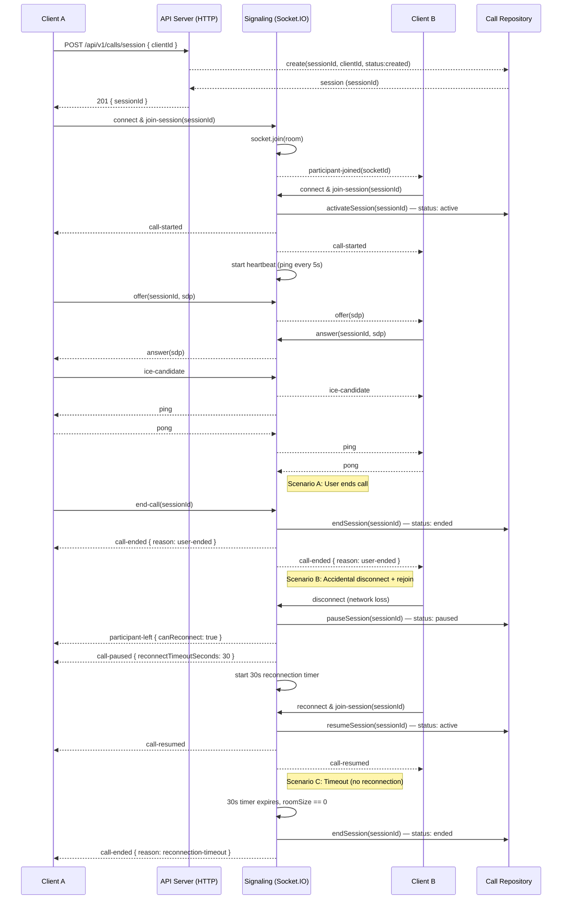

# Call Flow — Call Module

## Overview

- Base route: `/api/v1/calls` (mounted in `src/app.js`).
- Primary responsibilities: create call sessions, retrieve session info, end sessions, handle disconnections with reconnection grace period, and manage real-time signaling via sockets.

## HTTP Endpoints

- POST `/api/v1/calls/session` — `createSession` (`src/modules/calls/call.controller.js`) : Create a new call session. Returns a `sessionId`.
- GET `/api/v1/calls/session/:sessionId` — `getSession` : Retrieve session details.
- POST `/api/v1/calls/session/:sessionId/end` — `endSession` : End an existing session and compute duration.
- PATCH `/api/v1/calls/session/:sessionId/accept` — `acceptSession` : Accept the incoming call and activate the session.
- PATCH `/api/v1/calls/session/:sessionId/reject` — `rejectSession` : Reject the incoming call and end the session immediately.

> Implementation notes: routes are defined in `src/modules/calls/call.routes.js` and mounted under `/calls` by `src/routes/index.js` then prefixed with `/api/v1/` in `src/app.js`.
> Socket.IO signaling is initialized in `server.js` and handled by `src/modules/calls/signaling.socket.js`.
> Shared socket helpers in `src/helpers/sockets/roomManager.js` and `src/helpers/sockets/connectionManager.js` provide room membership tracking and socket-user registration.

## Session Status States

Call sessions now have 4 statuses:

- **created** — Session created, waiting for participants to join
- **active** — Both participants connected, call in progress
- **paused** — One participant disconnected but hasn't exceeded 30s timeout; waiting for reconnection
- **ended** — Call terminated (either manually or after timeout)

## Real-time Signaling (WebSocket events)

The signaling implementation is in `src/modules/calls/signaling.socket.js` and is wired into the app from `server.js` using Socket.IO. It supports the following socket events:

### Client → Server

- `join-session` { sessionId, userId? } — client joins the session room and optionally registers a user ID for the connection.
- `offer` { sessionId, ... } — send SDP offer to other participants.
- `answer` { sessionId, ... } — send SDP answer back.
- `ice-candidate` { sessionId, ... } — forward ICE candidates.
- `leave-session` { sessionId } — leave the session room (triggers reconnection window).
- `end-call` { sessionId } — explicit end call action (user pressed end button, no reconnection).
- `pong` — response to server's ping (heartbeat).

### Server → Client

- `participant-joined` { socketId, participants } — broadcast when a participant joins.
- `participant-left` { socketId, participants, canReconnect } — broadcast when a participant leaves (includes reconnection status).
- `call-started` — emitted when two participants are connected and the session becomes active.
- `call-paused` { reason, disconnectedSocketId, reconnectTimeoutSeconds } — session paused, waiting for reconnection within timeout.
- `call-resumed` — disconnected participant rejoined, call resuming.
- `call-ended` { reason } — call permanently ended (reasons: "user-ended", "all-participants-left", "reconnection-timeout").
- `ping` — sent every 5 seconds to check participant liveness; clients respond with `pong`.
- `offer` / `answer` / `ice-candidate` — forwarded to the other participants.

## Advanced Features

### Heartbeat / Liveness Detection

- Server sends a `ping` event to all participants every 5 seconds
- Clients respond with `pong`
- Detects stale connections and ensures connection stability

### Reconnection Window (30 seconds)

- When a participant **accidentally disconnects** (network loss, client crash):
    - Remaining participant(s) are notified via `participant-left` and `call-paused`
    - Session status: "active" → "paused"
    - 30-second timer starts
- If the disconnected participant **rejoins within 30 seconds**:
    - Emits `join-session` again with same sessionId
    - Server auto-resumes the session: "paused" → "active"
    - Emits `call-resumed` to both participants
    - Call continues seamlessly
- If **timer expires** without reconnection:
    - Server auto-ends the session
    - Emits `call-ended` with reason: "reconnection-timeout"
    - Session status: "paused" → "ended"

### Explicit End Call

- When user clicks "End Call" button, client emits `end-call` event
- **NO reconnection window** — call ends immediately
- Server ends session and emits `call-ended` with reason: "user-ended"
- All participants notified immediately

## Sequence Diagram



## Step-by-step Call Flow

### Normal Call (Happy Path)

1. **Initiate call** (Create session)

- Client A → HTTP: POST `/api/v1/calls/session` with body `{ clientId }`.
- Server: `createSession` creates a record with `sessionId` and `status: "created"`.
- Response: `201 { success: true, data: { sessionId, ... } }`.

2. **Participant A connects to signaling**

- Client A → Socket: `join-session` with `{ sessionId, userId? }`.
- Server: `signaling.socket.js` uses `roomManager` to track room members, joins socket to `sessionId` room.
- Broadcasts: `participant-joined` to room (no one else yet).

3. **Participant B connects to signaling**

- Client B → Socket: `join-session` with `{ sessionId, userId? }`.
- Server: Adds Client B to room, now room has 2 participants.
- Server: Calls `activateSession(sessionId)` to set `status: "active"` and record `startedAt`.
- Server: **Starts heartbeat** (ping every 5s).
- Broadcasts: `call-started` to both participants.

4. **Peer negotiation** (ICE exchange)

- Client A → Server: `offer` (contains SDP, `sessionId`)
- Server → Client B: forwards `offer`
- Client B → Server: `answer`
- Server → Client A: forwards `answer`
- Both clients exchange `ice-candidate` events via server until connectivity established.

5. **Call active**

- Media flows peer-to-peer (UDP, not through signaling server)
- Both clients respond to `ping` events with `pong` every 5 seconds

6. **End call** — Two scenarios:

    **Scenario A: User Explicitly Ends Call**

- Client A → Socket: `end-call { sessionId }`
- Server: Immediately calls `endSession(sessionId)` to set `status: "ended"` and record `endedAt`, `durationSeconds`.
- Server: Broadcasts `call-ended { reason: "user-ended", endedBy: socketId }` to all.
- Server: Cleans up all timers for this session.
- Response: All participants notified, call fully ends, **no reconnection window**.

**Scenario B: Accidental Disconnect (with Reconnection)**

- Client B loses connection (network drop, client crash, etc.)
- Socket.IO: `disconnect` event triggered
- Server: Calls `leaveRoom(sessionId, socketId)` function
- Server: Calls `pauseSession(sessionId)` to set `status: "paused"`.
- Broadcasts: `participant-left { socketId, participants: 1, canReconnect: true }`
- Broadcasts: `call-paused { reason: "participant-disconnected", disconnectedSocketId, reconnectTimeoutSeconds: 30 }`
- Server: **Starts 30-second reconnection timer** for this session
- Client A: Receives `call-paused` and `participant-left` events, UI shows "Waiting for reconnection..." state

**If Client B Reconnects Within 30 Seconds:**

- Client B → Socket: `join-session { sessionId, userId? }` (same sessionId)
- Server: Detects active reconnection timer for this session
- Server: Clears the reconnection timer
- Server: Calls `resumeSession(sessionId)` to set `status: "active"`.
- Broadcasts: `call-resumed` to both participants
- Call continues seamlessly as if disconnect never happened

**If 30 Seconds Expire Without Reconnection:**

- Server: Reconnection timer callback fires
- Server: Checks if room is still empty; if yes, calls `endSession(sessionId)` to set `status: "ended"`.
- Broadcasts: `call-ended { reason: "reconnection-timeout" }`
- Server: Cleans up all timers for this session
- Client A: Receives `call-ended`, call is now fully over

7. **Retrieve call details** (optional)

- Client → HTTP: GET `/api/v1/calls/session/:sessionId` to fetch final session data including duration.

## Client Implementation Reference

### Connect to Call

```javascript
socket.emit('join-session', { sessionId: 'uuid-here', userId: 'optional-user-id' });
socket.on('call-started', () => {
    // Begin WebRTC peer negotiation (exchange offer/answer)
});
```

### Handle Call Pause

```javascript
socket.on('call-paused', (data) => {
    console.log(`Call paused. Reconnection timeout: ${data.reconnectTimeoutSeconds}s`);
    // UI: Show "Waiting for participant to reconnect..." with countdown
});

socket.on('call-resumed', () => {
    // UI: Resume normal call state
});
```

### Respond to Heartbeat

```javascript
socket.on('ping', () => {
    socket.emit('pong'); // Critical: keep connection alive
});
```

### End Call

```javascript
// When user clicks "End Call" button
socket.emit('end-call', { sessionId: 'uuid-here' });

socket.on('call-ended', (data) => {
    console.log('Call ended:', data.reason);
    // reason: "user-ended" | "all-participants-left" | "reconnection-timeout"
    // Clean up UI, release resources
});
```

## Notes

- Session status is tracked in `src/database/models/call.session.model.js` and can be queried for analytics/billing.
- All timers (heartbeat, reconnection) are per-session in memory and use Maps for cleanup.
- Reconnection window is configurable (currently 30,000ms / 30 seconds) in `signaling.socket.js`.
- Bruno collection should include WebSocket examples or comments noting the socket events above.

---

Generated on: 2026-06-17
