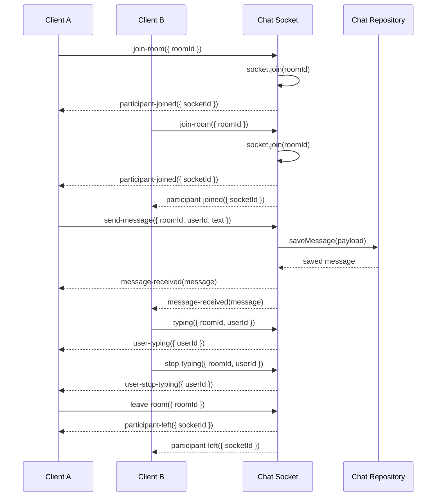

# Chat Flow — Chat Module

## Overview

- Base route: `/api/v1/chat-sessions` (mounted in `src/app.js`).
- Primary responsibilities: create chat rooms, fetch room history, persist messages, and publish real-time chat events via Socket.IO.
- Core files:
    - `src/modules/chats/chat.routes.js`
    - `src/modules/chats/chat.controller.js`
    - `src/modules/chats/chat.service.js`
    - `src/modules/chats/chat.socket.js`

## HTTP Endpoints

- POST `/api/v1/chat-sessions/rooms` — create a new chat room.
- GET `/api/v1/chat-sessions/rooms/:roomId/messages` — retrieve all messages for a room, sorted by `createdAt` ascending.

> Implementation notes: routes are defined in `src/modules/chats/chat.routes.js` and mounted under `/chat-sessions` in `src/routes/index.js`, then prefixed with `/api/v1/` in `src/app.js`.
> Socket.IO chat signaling is initialized in `server.js` and handled by `src/modules/chats/chat.socket.js`.
> Shared socket helpers in `src/helpers/sockets/roomManager.js` and `src/helpers/sockets/connectionManager.js` are used by both chat and call socket handlers.

## Persistence

- `ChatRoom` is defined in `src/database/models/chatRoom.model.js`.
- `ChatMessage` is defined in `src/database/models/chat.Message.model.js`.
- `roomId` is stored as `STRING`, allowing arbitrary room identifiers from the demo or clients.
- `senderId` and `message` are required; `receiverId` is nullable.

## Real-time Socket Events

`src/modules/chats/chat.socket.js` handles the socket lifecycle. Supported events:

- Client -> Server:
    - `join-room` { roomId, userId? }
    - `send-message` { roomId, userId, text, receiverId?, messageType? }
    - `typing` { roomId, userId }
    - `stop-typing` { roomId, userId }
    - `leave-room` { roomId }

- Server -> Client:
    - `participant-joined` { socketId }
    - `participant-left` { socketId }
    - `message-received` { id, roomId, senderId, receiverId, message, messageType, createdAt, updatedAt }
    - `user-typing` { userId }
    - `user-stop-typing` { userId }
    - `message-error` { roomId, error }

> Note: `send-message` is persisted via `chatService.saveMessage(payload)` before broadcasting the saved message to the room.

## Sequence Diagram

## Step-by-step Chat Flow

1. Client opens a Socket.IO connection.
2. Client emits `join-room` with `{ roomId, userId? }`.
    - Server uses `roomManager` to track room membership, optionally registers `userId` through `connectionManager`, adds the socket to the room, and broadcasts `participant-joined`.
3. Client sends a message with `send-message`.
    - Payload should include `{ roomId, userId, text }`.
    - Backend saves the message and then broadcasts `message-received` to all room members.
4. Clients receive `message-received` and render the chat message.
5. Clients can emit `typing` and `stop-typing` to signal presence during composition.
6. When a client leaves, `leave-room` is emitted.
    - Server broadcasts `participant-left`.
7. Message history is available via GET `/api/v1/chat-sessions/rooms/:roomId/messages`.

## Demo / Reference Client

- `src/public/demo/chat-demo.html`
- `src/public/demo/chat-demo.js`

The demo client:

- accepts a manual room ID
- connects to Socket.IO
- joins a room with `join-room`
- sends a message with `send-message`
- listens for `participant-joined`, `message-received`, and `message-error`

## Notes & Recommendations

- Room IDs are string-based and can be simple demo values like `room-123`.
- Keep room IDs consistent across clients to ensure they join the same room.
- `message-error` surfaces persistence failures so the frontend can show save errors.
- `leave-room` and socket disconnect both remove the socket from the room helper state and broadcast `participant-left` with the updated participant count.
- For production, add request validation middleware around socket payloads and HTTP body shape.
